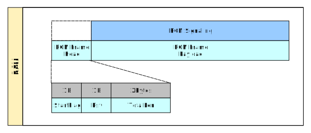
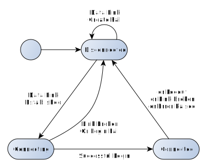

# 通讯协议

ROS Car Message Protocol 简称 (RCMP)，
主要用于定义系统中所使用的通讯信令。

其中包括：

* 控制信令及其回复
* 监控信令及其回复

项目的目的为学习 ROS，所以当前只考虑对系统唯一终端设备（Ros Car）的控制。
因此信令也做响应简化。

## 1. 版本信息

当前版本：1

版本历史

| 版本  |    日期    |  作者  |   说明 |
| :---: | :--------: | :----: | :--- |
|   1   | 2019-07-15 | Liu Yu | 初稿撰写 |

## 2. 类型定义

### 2.1. 数据类型定义

| 数据类型 |                                           说明                                            |
| -------- | ----------------------------------------------------------------------------------------- |
| Byte     | 无符号整数，长度为 1 个字节。                                                             |
| Short    | 无符号整数，长度为 2 个字节。按网络字节序排序（bigendia）。数据不满时左补二进制零（\0）。 |
| JSON     | 满足 JSON 格式的 ASCII 字符串。                                                           |

### 2.2. 终端类型定义

| 终端类型 |   定义   |         说明         |
| -------- | -------- | -------------------- |
| 设备终端 | Terminal | ROS 终端测试小车     |
| 用户终端 | Client   | 用户终端、外部系统等 |

## 3. RCMP 通讯协议

RCMP 协议中数据包部分由 RCMP 信令及 RCMP 数据帧两部分组成，如下图所示：



* RCMP 信令：RCMP 信令以 JSON 格式定义。
* RCMP 数据帧：二进制格式，用于包裹 RCMP 信令。

### 3.1. RCMP 数据帧定义

数据帧定义如下：

| 数据项名称 | 偏移量（字节） | 数据类型 |  长度（字节）  |                   说明                    |
| ---------- | -------------- | -------- | -------------- | ----------------------------------------- |
| StartFlag  | 0              | Byte     | 1              | 数据包起始标志，固定为十六进制数 0x5A。   |
| Rsv        | 1              | Byte     | 1              | 保留字段，始终为二进制零。                |
| Length     | 2              | Short    | 2              | 数据包总长度，包括 RCMP 数据帧头 及 负载。 |
| Payload    | 4              | JSON     | 数据帧总长 - 4 | 数据帧载荷，JSON 格式。                   |

### 3.2. RCMP 信令定义

RCMP 信令符合 JSON 规范。格式定义如下：

#### 3.2.1. 请求信令格式

``` json
{
  "cmd": "cmd id",
  "seq": 0,
  "payload": null
}
```

其中相关数据字段含义如下：

* cmd: 请求信令 ID，区分大小写，定义见后。
* seq: 信令序列号。此序列号为符合 JSON 规范的不为负整数，由请求方生成，无需连续，但在同一会话中应保持唯一。
* payload: 信令数据，定义见具体数据。

#### 3.2.2. 回复信令格式

``` json
{
  "cmd": "cmd id",
  "seq": 0,
  "errno": 0,
  "errmsg": "",
  "payload": null
}
```

其中相关数据字段含义如下：

* cmd: 回复信令 ID，区分大小写，定义见后。
* seq: 信令序列号。此序列号为符合 JSON 规范的不为负整数，由请求方生成。回复信令中的序列号应与对应请求信令中的序列号应相同。
* errno: 字符串格式错误码，定义见后。
* errmsg: 字符串格式错误说明，无错误时可为空。
* payload: 信令数据，定义见具体数据。

#### 3.2.3. RCMP 信令 ID

|  信令 ID   |      说明      |
| ---------- | -------------- |
| Login      | 登录信令。     |
| LoginResp  | 登录信令回复。 |
| Logout     | 退出信令。     |
| LogoutResp | 退出信令回复。 |
| ---------- | -------------- |
| Ping       | 心跳测试       |
| Pong       | 心跳测试回复   |
| ---------- | -------------- |
| Info       | 请求设备信息     |
| InfoResp   | 请求设备信息回复  |
| ---------- | -------------- |
| Move       | 移动指令     |
| MoveResp   | 移动指令回复  |

各信令其具体定义见后续章节。

#### 3.2.4. RCMP 信令 错误码定义

| 错误码  |     说明     |
| ------- | ------------ |
| SUCC    | 执行成功     |
| FAIL    | 执行失败     |
| INV_FMT | 无效协议格式 |
| INV_VER | 无效协议版本 |

### 3.3. 会话建立、维持与信令收发

* 底层通讯链路建立后，客户端因通过 Login 信令建立会话。
* 会话建立后，通讯双方可互发心跳信令 Ping，来测试与维护与对端的会话。
* 会话建立后，每当空闲超过 30 秒，通信双方需发送 Ping 信令维持会话。当连续两个 Ping 信令没有响应时，此会话应被断开。
* 当通讯双方检测到数据帧发生错误时，应发送错误码为 INV_FMT 的回复信令（此回复中消息 ID 为空，序列号为 0），然后断开链路。
* 会话建立后，通讯双方均可通过 Logout 信令中断会话。发送方发送 Logout 信令并等待相关回复后即可断开链路；

  接受方接收 Logout 信令并发送相关回复后即可断开链路。

* 本协议支持收到回复数据包之前并发发送请求数据包。最大并发量设定为 64。

### 3.4. 会话状态机

会话状态机如下图所示：



## 4. 信令列表

### 4.1. Login 与 LoginResp

Login 信令格式定义如下：

``` json
{
  "cmd": "Login",
  "seq": 0,
  "payload": {
    "ver": 0,
    "type": "",
    "id": ""
  }
}
```

payload 含义：

* ver: 通讯协议版本。
* type: 终端类型，见之前章节定义。
* id: 终端 ID，由相关配置文件设定。

LoginResp 信令格式定义如下：

``` json
{
  "cmd": "LoginResp",
  "seq": 0,
  "errno": 0,
  "errmsg": "",
  "payload": null
}
```

payload 含义：

无

### 4.2. Logout 与 LogoutResp

Logout 信令格式定义如下：

``` json
{
  "cmd": "Logout",
  "seq": 0,
  "payload": null
}
```

payload 含义：

无

LogoutResp 信令格式定义如下：

``` json
{
  "cmd": "LogoutResp",
  "seq": 0,
  "errno": 0,
  "errmsg": "",
  "payload": null
}
```

payload 含义：

无

### 4.3. Ping 与 Pong

Ping 信令格式定义如下：

``` json
{
  "cmd": "Ping",
  "seq": 0,
  "payload": null
}
```

payload 含义：

无

Pong 信令格式定义如下：

``` json
{
  "cmd": "Pong",
  "seq": 0,
  "errno": 0,
  "errmsg": "",
  "payload": null
}
```

payload 含义：

无

### 4.4. Info 与 InfoResp

Info 信令格式定义如下：

``` json
{
  "cmd": "Info",
  "seq": 0,
  "payload": null
}
```

payload 含义：

无

InfoResp 信令格式定义如下：

``` json
{
  "cmd": "InfoResp",
  "seq": 0,
  "errno": 0,
  "errmsg": "",
  "payload": {
    "id": "",
    "type": "",
    "name": ""
  }
}
```

payload 含义：

* id: 设备 ID。
* type: 设备类型。
* name: 设备名。

### 4.5. Move 与 MoveResp

Move 信令格式定义如下：

``` json
{
  "cmd": "Move",
  "seq": 0,
  "payload": {
    "angle": 0,
    "power": 100,
    "duration": 0
  }
}
```

payload 含义：

* angle: 修改移动方向，以当前设备方向逆时针为正方向，以 度 为单位，默认为 0。
* power: 移动功率，有效值为 [0:100]，默认为 100。
* duration: 移动持续时间，以秒为单位，负数表示持续运行。

MoveResp 信令格式定义如下：

``` json
{
  "cmd": "MoveResp",
  "seq": 0,
  "errno": 0,
  "errmsg": "",
  "payload": null
}
```

payload 含义：

无

### 4.6. Video

#### 4.6.1. List video request 与 response

request 信令格式定义如下：

``` json
{
  "cmd": "Video",
  "seq": 0,
  "payload": {
    "action": "list"
  }
}
```

payload 含义：

* action: list - 列出当前可用视频流。

VideoResp 信令格式定义如下：

``` json
{
  "cmd": "VideoResp",
  "seq": 0,
  "errno": 0,
  "errmsg": "",
  "payload": {
    "action": "list",
    "list":  [
      {"node": "node id 1", "video": "video id 1"},
      {"node": "node id 2", "video": "video id 2"}
    ]
  }
}
```

payload 含义：

* action: 固定为 list。
* list: 视频流信息列表，包括各个视频流的 node id 及 video id。

#### 4.6.2. Open video request 与 response

Video List 信令格式定义如下：

``` json
{
  "cmd": "Video",
  "seq": 0,
  "payload": {
    "action": "open",
    "node": "node id",
    "video": "video id"
  }
}
```

payload 含义：

* action: open - 开启指定视频流（以 Topic 方式播放流）。
* node: 视频流所属的 node id。
* video: 视频流 id。

VideoResp 信令格式定义如下：

``` json
{
  "cmd": "VideoResp",
  "seq": 0,
  "errno": 0,
  "errmsg": "",
  "payload": {
    "action": "open",
    "topic": "topic id",
  }
}
```

payload 含义：

* action: 固定为 open。
* topic: 包含视频流的 Topic 名。
